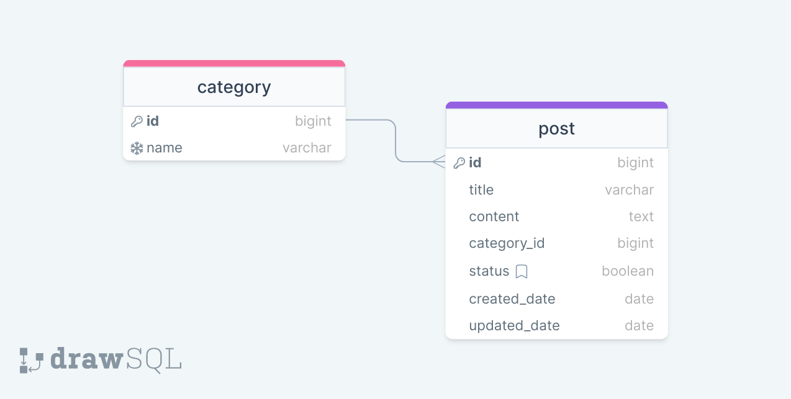

# Django Blog API

A RESTful blog backend built with **Django** and **Django REST Framework**. The project includes blog and category management, token-based authentication, user registration, filtering, search and pagination.



## Features

- Blog CRUD API
- Category CRUD API
- User registration
- Token-based login and authentication
- Read-only access for anonymous users
- Authenticated write access for blog content
- Staff-only write access for categories
- Search across blog title and content
- Category filtering
- Page-number pagination

## Tech stack

- Python
- Django 4
- Django REST Framework
- django-filter
- Token Authentication
- SQLite

## API endpoints

| Endpoint | Purpose |
| --- | --- |
| `/api/blog/` | List, create, retrieve, update and delete blog posts |
| `/api/category/` | List and manage categories |
| `/user/register/` | Register a user |
| `/user/login/` | Obtain an authentication token |
| `/admin/` | Django admin |

### Filtering and search

Blog posts can be filtered by category:

```text
/api/blog/?category=1
```

Blog posts can be searched by title or content:

```text
/api/blog/?search=django
```

Categories can be filtered by name:

```text
/api/category/?name=Backend
```

## Permissions

- Blog endpoints are readable by everyone.
- Creating, updating and deleting blog posts requires authentication.
- Category endpoints are readable by everyone, while write operations require a staff user.

## Local setup

### 1. Clone the repository

```bash
git clone https://github.com/omersb/Blog_App-django.git
cd Blog_App-django
```

### 2. Create and activate a virtual environment

macOS / Linux:

```bash
python3 -m venv venv
source venv/bin/activate
```

Windows:

```bash
python -m venv venv
venv\Scripts\activate
```

### 3. Install dependencies

```bash
pip install -r requirements.txt
```

### 4. Create environment variables

Create a `.env` file in the project root:

```env
SECRET_KEY=your-django-secret-key
```

### 5. Apply migrations

```bash
python manage.py migrate
```

### 6. Optional: create an admin user

```bash
python manage.py createsuperuser
```

### 7. Run the development server

```bash
python manage.py runserver
```

The API will be available at:

```text
http://127.0.0.1:8000/
```

## Authentication

After registering a user, obtain a token from:

```text
POST /user/login/
```

Authenticated API requests use DRF token authentication:

```http
Authorization: Token <your-token>
```

## Project structure

```text
Blog_App-django/
├── blog/          # Blog and category API
├── user/          # Registration and login
├── main/          # Django project configuration
├── manage.py
└── requirements.txt
```

## Author

**Ömer Said Bulduk**

- Portfolio: https://omersb.dev/
- GitHub: https://github.com/omersb
- LinkedIn: https://www.linkedin.com/in/omersaidbulduk/
